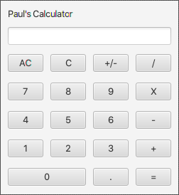

# Basic Calculator

## GitHub Classroom 

This project is distributed and collected using GitHub Classroom.  GitHub Classroom will create a copy of the assignment just for you when you check it out.  You'll then clone that repository to your computer, do the assignment and push it back up to GitHub before turning it in.  I have access to anything you push to GitHub so if you are stuck and have questions for me push your code up and email me with the repository URL and your question.  When you're reading to turn in the assignment, simply submit the URL in the Assignment submission on Blackboard.  
## The assignment 

Use Scene Builder and Intellij to build a basic calculator using Java and JavaFX.  The Calculator should display text at the top that says [your name]'s Calculator, followed by the display and then the normal keypad layout.  See image below. 

I was able to create this with simple Layouts and elements we used in class for the tip calculator example but you are welcome to use any elements you wish from Scene Builder.

The starter code for this assignment is the example JavaFX template generated by Intellij with the file and class names changed to Calculator.  Replace the CalculatorController and Calculator.fxml with the files and examples you create in Scene Builder then wire up the Controller so the calculator works as you would expect a calculator to.  AC is for "All Clear" and C just clears the current entry.

Once you are done you'll commit and push your work to GitHub then Copy and paste the repository URL in the assignment submission text on Blackboard. 

